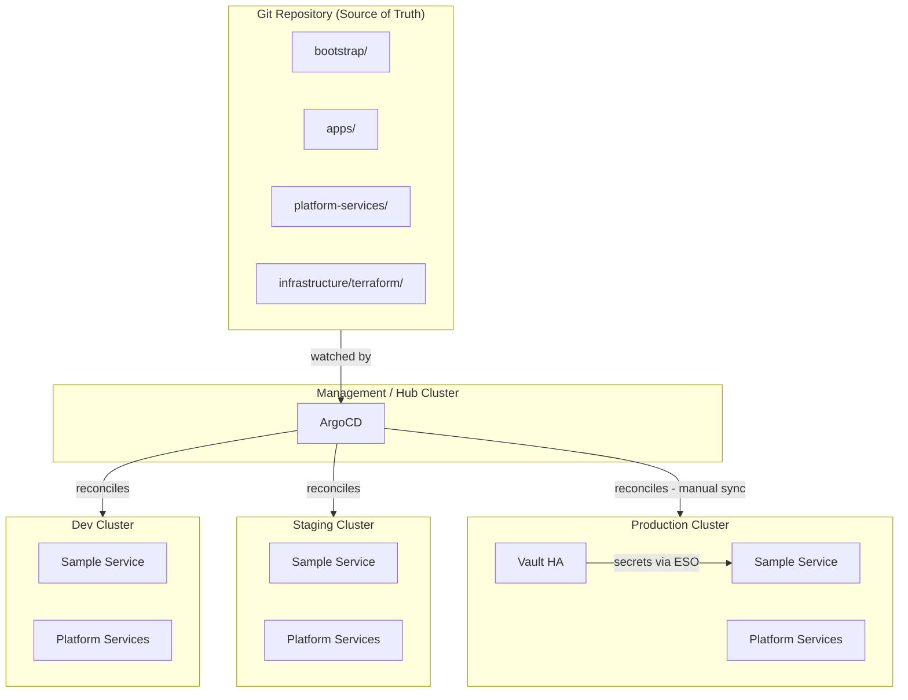
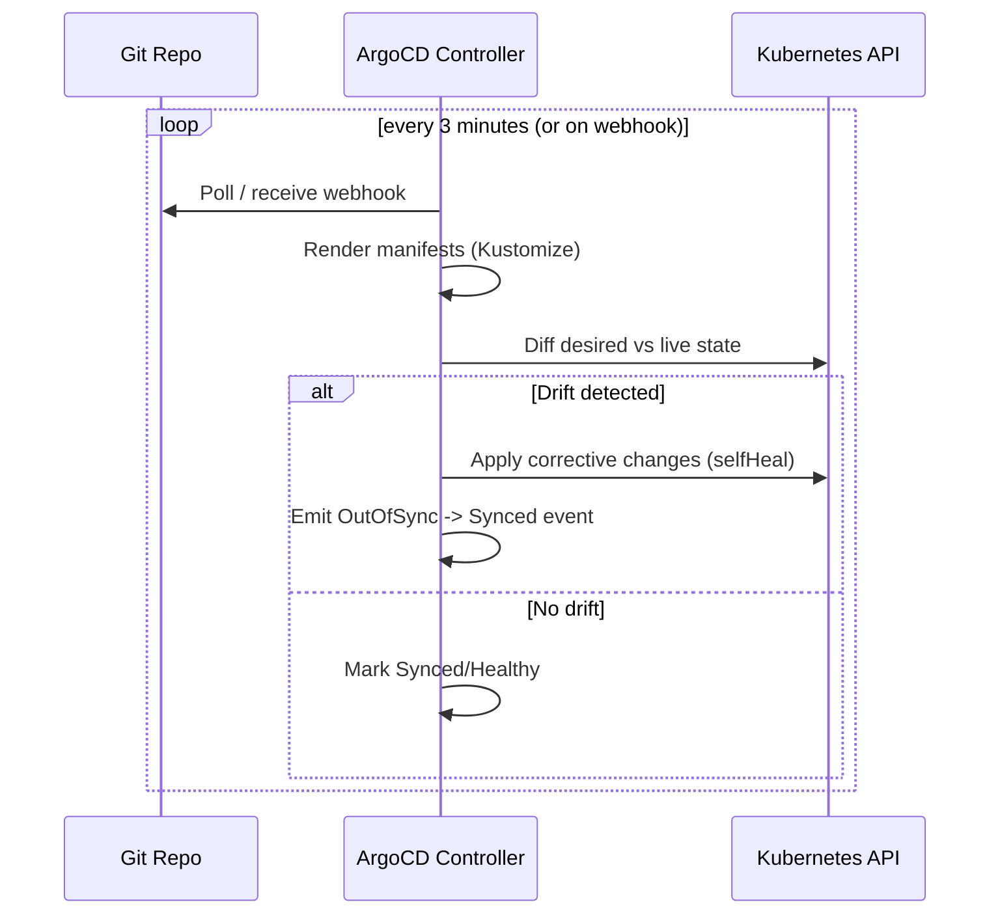
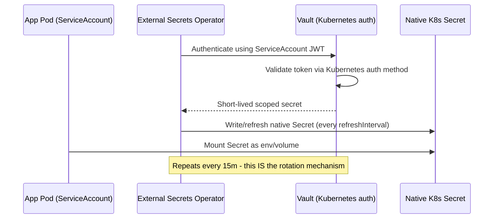

# Platform Architecture

## High-Level Platform Architecture

## GitOps Reconciliation Loop

## Vault Secret Flow

## Environment Promotion Flow

## Why GitOps

- **Auditability**: every change to cluster state is a Git commit with an author, timestamp, and PR review trail — no `kubectl apply` from a laptop leaves cluster state unexplained.
- **Repeatability**: rebuilding an entire environment is `git clone` + point ArgoCD at it, not a runbook of manual steps.
- **Security**: cluster credentials never leave the cluster/ArgoCD boundary; CI never needs `kubectl` access to prod, only push access to Git.
- **Operational consistency**: dev, staging, and prod are the same Kustomize base with explicit, reviewable overlays — configuration drift between environments becomes a diff, not a mystery.
- **Disaster recovery**: Git + Vault backup is sufficient to reconstruct full cluster state from nothing.
